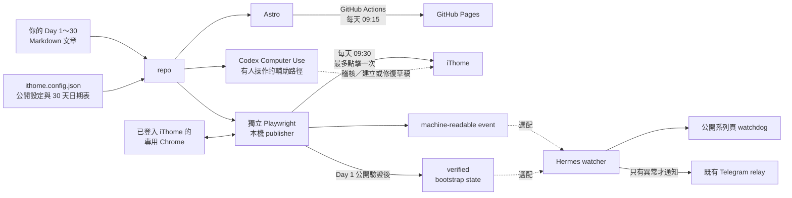

# iThome 鐵人賽 30 天發布模板

## 共用內容模板

這個 repo 已經準備好一套可以發布到 GitHub Pages 的網站模板，不需要從零開始做網站。Fork 或下載後，只要把範例資料換成自己的內容，就能建立一個包含首頁、三十天學習地圖、文章頁與延伸閱讀的公開網站。

你可以填入或調整：

- 網站名稱、首頁介紹與系列說明。
- 自己規劃的學習地圖章節，不限固定章數。
- Day 1～30 的正式文章、標題、摘要與發布日期。
- 鐵人賽以外的心得、補充文章與相關 Day 連結。
- 網站標誌、圖示，以及 GitHub Pages 網址設定。

不必修改發布程式才能填入內容。基本資料集中寫在 `ithome.config.json`，文章則放進下方兩個內容資料夾；推送到 GitHub 並啟用 Pages 後，GitHub Actions 會把它建置成公開網站。

### 正式設定與範例設定

- `ithome.config.json`：網站與發布工具實際讀取的正式設定。請把自己的系列標題、簡介及公開帳號等資料填在這裡，並一起提交，讓 GitHub Pages 可以建置。
- `ithome.config.example.json`：保留「系列標題」、「系列簡介」等填寫提示，以及示意帳號與網址，供其他人參考或複製。程式不會自動讀取或同步這份檔案。

Fork 會取得本 repo 已提交的全部文章和正式設定，這是預期行為，不會自動重設為範例。你可以直接修改正式設定；若要從範例開始，請先備份自己的 `ithome.config.json`，再將範例內容複製到正式設定。複製會覆蓋原有設定，但不會刪除或重設文章。

複製後請執行 `pnpm ithome:setup`，填入自己的帳號、系列、日期與 GitHub repo，再調整首頁文案及文章內容。兩份設定都只放公開資料，不能放密碼、金鑰或登入資訊。日後只修改自己的文案時，不需要同步修改範例；新增或移除設定欄位時，才需同步維護範例結構。

本專案把內容分成兩種：

- `src/content/ironman/day-01.md`～`day-30.md`：鐵人賽主系列。Day 1～30 與日期必須連續，網址固定為 `/day/NN/`，也是 `ithome:prepare` 唯一會讀取的內容。
- `src/content/extensions/*.md`：延伸閱讀。可以在任意日期發布，網址為 `/articles/<slug>/`，不占 Day 編號、不影響三十天進度，也不會進入 iThome publisher。

`ithome.config.json` 使用 schemaVersion 2，集中設定系列名稱、首頁導言、可自訂的學習地圖章節、延伸閱讀標題、品牌資產與 GitHub Pages。學習地圖章節數量不限五個；文章以穩定的 `section` ID 對應章節。

目前文章都是清楚標示的開發期佔位內容，正式寫作前請完整替換。

這是一個可以 fork 或下載後改成自己系列的模板。它採用「Codex Computer Use＋獨立 Playwright publisher」混合架構，目標是在保留安全檢查與人工救援能力的同時，讓正式安裝後的每日發布可以無人值守。

同一份 Day 1～30 Markdown 文章會用在兩個地方：

1. Astro 建置的 GitHub Pages 公開網站。
2. 本機 publisher 準備並核對 iThome 發布內容。

Hermes 監控是選配。沒有 Hermes，網站與 publisher 仍能使用。

> 這個 repo 不會替你保存 iThome 登入資料，也不會因為執行測試就發布文章。正式 iThome 發布、GitHub Pages 部署與本機排程都需要另外明確操作及驗收。

## 執行架構



### 為什麼要使用混合架構？

Codex Computer Use 可以看懂 iThome 畫面，適合在有人參與時稽核、建立或修復草稿；但它的最終公開 publish click 需要當下確認，不能直接變成每天 09:30 的無人值守排程。

因此，本專案把工作拆開：

1. **Codex Computer Use 負責準備與救援**：依 repo payload 檢查 iThome、建立缺少的草稿、處理可安全確認的異常。這些操作由使用者在對話中明確授權。
2. **獨立 Playwright publisher 負責每日發布**：連接本機專用 Chrome，於 09:30 重新核對帳號、系列、唯一草稿與 payload；全部吻合才最多點擊一次發布。
3. **Hermes 負責選配監控**：正常時保持安靜，只有缺稿、重複、不一致、失敗或公開頁面異常時才通知。

這種混合分工才是本專案的無人值守方案：正常日由 Playwright publisher 自動發布，不需要等人確認；發生問題才由 Hermes 通知，再使用 Codex Computer Use 或人工方式處理。無人值守能力只有在專用 Chrome、09:30 本機排程與真實發布驗收都完成後才算正式啟用。

文章與公開設定都放在 repo；登入資料與執行狀態留在各自的本機環境：

- GitHub Actions 只負責建置 GitHub Pages，不取得 iThome 登入資料。
- 本機 publisher 讀取同一份文章與 `ithome.config.json`，再操作已登入的專用 Chrome。
- Hermes 是選配，只讀 publisher event 與 verified bootstrap state；它不登入 iThome，也不負責發文。
- Hermes 啟用後仍會透過既有公開系列頁 watchdog 自動檢查公開文章列表，不需要每天人工設定文章網址。

## 最短使用順序

1. Fork 或下載 repo，執行 `pnpm install`。
2. 執行 `pnpm ithome:setup`，填入公開帳號、系列、Day 1 日期與 GitHub repo。
3. 依初始化產生的日期表，把 Day 1～30 文章換成自己的內容。
4. 執行 `pnpm test:ithome`、`pnpm build` 與 `pnpm ithome:prepare -- --day 1 --json`。
5. 推送到 GitHub，啟用 GitHub Pages，確認 09:15 workflow 成功。
6. 在 iThome 準備唯一且內容相符的草稿，再於 repo 外建立專用 Chrome profile，手動登入自己的 iThome。
7. 另外安裝並驗收 09:30 本機 publisher 排程；repo 不會只靠 `pnpm install` 自動建立它。
8. 需要異常 Telegram 通知時，再選配 Hermes。

下面各節會逐步說明每一步；不懂指令時，可直接把「可直接交給 AI Agent 的指令」整段交給 Agent。

如果只需要 GitHub Pages，做到第 5 步即可。需要自動發布到 iThome，才繼續第 6～7 步；需要 Telegram 異常通知，才設定第 8 步 Hermes。

## 先認識三種資料

- `src/content/ironman/day-01.md`～`day-30.md`：鐵人賽文章唯一正式來源。
- `src/content/extensions/*.md`：延伸閱讀來源，不進入 publisher。
- `ithome.config.json`：可提交的公開設定，例如帳號顯示名稱、系列名稱、比賽標籤、30 天日期與 GitHub Pages 網址。
- repo 外的本機資料：Chrome profile、cookie、登入 session、事件目錄、bootstrap state、Telegram credential。這些永遠不能 commit。

## 1．Fork 或下載

Fork 後 clone：

```bash
git clone https://github.com/YOUR_GITHUB_NAME/YOUR_REPO.git
cd YOUR_REPO
pnpm install
```

也可以下載 ZIP、解壓縮後進入資料夾，再執行 `pnpm install`。若使用 ZIP，之後要自行建立 GitHub repo 才能發布 Pages。

## 2．只做一次初始化

你必須明確提供 Day 1 的完整日期。程式不會從今天、文章順序或 iThome 畫面猜日期。

執行前先準備以下 7 項公開資料：

| 要準備的資料 | 白話說明 | 範例 |
| --- | --- | --- |
| iThome 帳號 | 別人在公開頁面看得到的帳號名稱 | `YOUR_ITHOME_NAME` |
| 系列名稱 | 報名鐵人賽時使用的完整名稱 | `我的 30 天系列` |
| contest tag | iThome 畫面顯示的比賽標籤 | `18th鐵人賽` |
| contest 識別 | repo 內使用的穩定識別文字 | `18th-ironman-2026` |
| Day 1 日期 | 正式開賽第一天，格式必須是 YYYY-MM-DD | `2026-09-01` |
| GitHub owner | 你的 GitHub 帳號或組織名稱 | `YOUR_GITHUB_NAME` |
| GitHub repo | fork 後的 repo 名稱 | `YOUR_REPO` |

一般使用者建議直接執行互動式精靈：

```bash
pnpm ithome:setup
```

精靈會逐題詢問這 7 項資料，接著顯示 GitHub Pages 網址與完整 Day 1～30 日期表。只有最後回答 `yes` 或 `y` 才會寫入；回答其他內容會取消，不修改設定檔。精靈不會詢問密碼、cookie、token、Chrome profile 或登入 session。

如果把 repo 交給 AI Agent，Agent 可以逐題向你詢問缺少的資料，再使用以下明確參數模式：

```bash
pnpm ithome:setup -- \
  --account "你的公開 iThome 帳號" \
  --series-title "你的完整系列名稱" \
  --contest-tag "畫面顯示的比賽標籤" \
  --contest "穩定的比賽識別，例如 18th-ironman-2026" \
  --day1-date "2026-09-01" \
  --github-owner "YOUR_GITHUB_NAME" \
  --github-repo "YOUR_REPO"
```

兩種模式都會產生相同的 `ithome.config.json`，並明確列出 Day 1～30 的每一天。它們可以用相同資料重跑；不會建立 cookie、登入資料、排程或秘密。請人工檢查設定檔，再把它與文章一起 commit。

若使用 GitHub 使用者首頁 repo（repo 名稱剛好是 `帳號.github.io`），初始化器會使用空的 Pages base；一般 project Pages 則使用 `/<repo 名稱>`。

## 3．換成自己的 Day 1～30 文章與延伸閱讀

建立 `src/content/ironman/day-01.md` 到 `day-30.md`，檔名不能跳號。每篇至少包含：

```yaml
---
title: "文章標題"
description: "文章摘要"
publishDate: 2026-09-01
tags: [AI, Agent]
draft: true
day: 1
section: "foundation"
---

文章正文
```

`day`、檔名、`publishDate` 與設定日期表必須吻合；`section` 必須是 `learningMap.sections` 中已設定的 ID。iThome 專用同步連結會在產生 payload 時加入，不要寫回 Markdown。

延伸閱讀放在 `src/content/extensions/`：

```yaml
---
title: "參賽心得"
slug: "ironman-retrospective"
description: "完成三十天後的回顧"
publishDate: 2026-10-15
draft: true
relatedDays: [1, 30]
---
```

`relatedDays` 可省略；填入時只能指向現有的 Day 1～30。

文章還在修改時使用 `draft: true`，這樣不會出現在 GitHub Pages。確認文章可以公開後，才改成 `draft: false`，再執行測試、建置與 push。這個欄位只控制 GitHub Pages 是否顯示文章，不會代替 iThome 的草稿或發布按鈕。

## 4．本機驗證

```bash
pnpm test:ithome
pnpm build
pnpm ithome:prepare -- --day 1 --json
```

`ithome:prepare` 只讀 repo 並產生 payload，不會開 Chrome 或連到 iThome。它會檢查 Day、日期、標題、正文與公開網址；缺設定或不一致就停止。

## 5．啟用 GitHub Pages

1. 把變更推到 GitHub 的 `main` 分支。
2. 到 repo 的 **Settings → Pages**。
3. 在 **Build and deployment** 選擇 **GitHub Actions**。
4. 手動執行一次 `Deploy to GitHub Pages` workflow，確認成功且網址與 `ithome.config.json` 一致。

workflow 也會每天在 Asia／Taipei 09:15 建置。測試通過不等於已部署；必須看到 GitHub Actions 成功與實際公開頁面。

GitHub Pages 的網站外觀可以自行修改，例如顏色、字型、首頁排版、文章版型與導覽列。常見檔案位於 `src/layouts/`、`src/pages/` 與 `src/styles/`（如有）。只改網站樣式不會改變 iThome publisher 使用的文章內容。

修改外觀時，請保留 `/day/01/`～`/day/30/` 文章網址規則，以及 `ithome.config.json` 產生的 Pages `site`、`base` 與 `publicUrl`。修改後重新執行 `pnpm build`，並實際打開 GitHub Pages 確認首頁、文章頁與連結正常。

## 6．準備專用 Chrome

請建立獨立 Chrome profile，並由人手動登入正確的 iThome 帳號。profile 必須放在 repo 外。

macOS 範例：

```bash
/Applications/Google\ Chrome.app/Contents/MacOS/Google\ Chrome \
  --remote-debugging-address=127.0.0.1 \
  --remote-debugging-port=9223 \
  --user-data-dir="/你自己的/repo外路徑/ithome-publisher-chrome" \
  https://ithelp.ithome.com.tw/
```

CDP 只能使用 `127.0.0.1`、`localhost` 或 `::1`。不可綁到 LAN／公開網路，也不可把 profile、cookie、session、密碼或一次性驗證碼交給 repo 或 Agent。

### Codex Computer Use 和專用 Chrome 不是同一件事

本專案可以使用 Codex Computer Use 協助操作 iThome，但它不是每天 09:30 的定時發布器。

| 工具 | 適合做什麼 | 是否能作為 09:30 無人值守排程 |
| --- | --- | --- |
| Codex Computer Use | 在使用者對話與授權下檢查 iThome 畫面、稽核草稿、建立缺少的草稿、修復可安全確認的草稿 | 不行。公開發布屬於對外行為，Computer Use 的最終 publish click 仍需要當下確認 |
| 獨立 Playwright publisher | 讀取 repo payload，連到本機專用 Chrome，核對唯一草稿並最多點擊一次發布 | 可以，但必須另外安裝本機排程並完成真實驗收 |
| Hermes | 讀取結果、檢查公開系列列表、異常時通知 | 不行。Hermes 不負責發布 |

Computer Use 使用的瀏覽器工作階段與無人值守 publisher 的專用 Chrome profile 都不能提交到 repo，也不要互相複製 cookie。若使用 Computer Use 建立草稿，完成後仍要由 publisher 在自己的專用 Chrome 中重新核對登入帳號、唯一草稿與 payload。

## 7．設定本機 publisher

### 7.1．先在 iThome 準備草稿

本機 publisher 的工作是「核對並發布既有草稿」，不會在 09:30 臨時建立草稿。每個要自動發布的 Day，都必須先在 iThome 存在一篇唯一草稿，而且標題、系列、contest tag、同步連結與正文要和 repo payload 完全一致。

草稿可以由人手動建立，也可以把 repo 交給支援 Computer Use 的 AI Agent，使用專案內的 `ithome-ironman-publisher` skill 執行 `import-drafts --day N`。這是會改動 iThome 的操作，必須另外明確授權；Agent 只能建立缺少的草稿並儲存，不能刪除或覆寫衝突草稿。若尚未驗證 iThome 能安全保存多篇未來 Day 草稿，就不要一次使用 `--all`。

### 7.2．提供本機環境設定

以下值只放在本機執行環境，不提交：

```bash
export ITHOME_CDP_ENDPOINT="http://127.0.0.1:9223"
export ITHOME_DRAFTS_URL="https://ithelp.ithome.com.tw/你的草稿列表"
export ITHOME_PUBLIC_ARTICLES_URL="https://ithelp.ithome.com.tw/你的公開文章列表"
export ITHOME_EVENT_DIR="/repo外的絕對路徑/events"
export ITHOME_BOOTSTRAP_STATE="/repo外的絕對路徑/state/series-bootstrap.json"
```

公開帳號、系列名稱與 contest tag 由 `ithome.config.json` 讀取，不再寫死在 publisher。

### 7.3．確認真實發布指令

`pnpm ithome:publish-local -- --day 1` 會操作真實網站。只有在使用者另外明確授權真實發布時才能執行。Day 必須明確指定 1～30；publisher 最多點一次發布，結果不明就停止且不可重試。

Day 1 發布後，還必須從公開文章驗證系列連結，才可建立 verified bootstrap state。Day 2～30 缺少有效 state 時會 fail closed，不會猜 series ID。

### 7.4．另外安裝 09:30 排程

這個 repo 提供 publisher 指令與安全規則，但不會自動修改你的作業系統排程。macOS 可以使用 LaunchAgent，Linux 可以使用 systemd timer；實際方式依執行 publisher 的電腦而定。

排程必須做到：

- 每天使用 Asia／Taipei 09:30。
- 根據 `ithome.config.json` 的明確日期表找出 Day，不可只用「今天減 Day 1」的臨時計算或從 iThome 畫面猜測。
- 在持有專用 Chrome profile 的同一個本機使用者環境執行。
- 帶入 7.2 的本機環境設定，但不把它們寫進 repo。
- 同一天不得平行執行或自動重試 publish click。
- 缺文章、缺唯一草稿、登入失效或結果不明時停止並留下 machine-readable event。

由於安裝排程會修改本機環境，請先完成一次不點擊發布的 preflight，再明確授權 AI Agent 安裝。安裝完成後，要求 Agent 回報排程檔位置、執行使用者、時區、下一次執行時間與 dry-run／mock 驗證結果。正式 Day 1 發布仍要等開賽後驗收。

## 8．用 Hermes 接收發文提醒（選用）

這一段不是自動發文。Hermes 只負責兩件事：提醒你今天要發哪一篇，以及檢查文章有沒有正確出現在公開系列頁。本文所說的 publisher，就是前面負責發布文章的本機程式。

Hermes 不會登入 iThome、不會讀取草稿正文，也不會替你按下發布。iThome 的登入資料留在 publisher 使用的 Chrome；Telegram 的連線資料留在 Hermes，兩邊不要交換。

### 啟用後會發生什麼事？

比賽期間每天會執行三次：

- 09:00：一定會提醒「今天應發布 Day 幾」。
- 19:00：第一次檢查公開系列頁。
- 22:30：再檢查一次公開系列頁。

晚間檢查會找到系列的最後一頁與最後一篇文章，再核對文章標題、發布日期、網址，以及文章裡的個人連載網站連結。全部正確就不傳訊息；有缺漏才通知你。

如果只是 iThome 頁面暫時讀不到，Hermes 會再試 2 次，每次間隔 2 分鐘。三次都失敗後，才通知你人工檢查。它不會把「網站讀不到」誤報成「文章尚未發布」。

不在 `ithome.config.json` 設定的 30 天比賽日期內，三個任務都會保持安靜。

### 已經測過哪些部分？

2026-08-29 曾使用另一個公開系列做一次測試：09:00 提醒有收到；19:00 與 22:30 也能讀取系列列表，並在最後一篇不是預期的 Day 17 時傳送提醒。

這證明 Hermes 能讀公開系列頁並回報到 Telegram。不過，那次使用的是別人的測試系列，不代表本專案的正式排程已經啟用；「頁面讀取失敗後重試」也還需要在正式 Hermes 環境做一次不影響真實資料的測試。

### 開始前，先準備 4 個位置

如果你不知道這些位置在哪裡，可以直接把下面整段交給 AI Agent，請它先找出實際路徑，不要自己猜。

1. 專案資料夾：這個 repo 在電腦上的完整路徑。
2. 發布結果資料夾：publisher 每次完成後放結果檔案的位置。
3. 系列資料檔：Day 1 發布後，記錄正確系列網址的 `series-bootstrap.json`。
4. Hermes 私有資料夾：只能讓 Hermes 寫入，用來記住哪些提醒已經傳過。

本專案原始測試環境通常使用：

```text
專案資料夾：<你的專案資料夾完整路徑>
發布結果資料夾：/Users/Shared/ithome-ironman-bridge/events/
系列資料檔：/Users/Shared/ithome-ironman-bridge/state/series-bootstrap.json
Hermes 私有資料夾：請讓 Hermes 回報它實際使用的位置，不要放在共享資料夾裡。
```

如果你的專案不在上述位置，請先把路徑換成自己的實際位置，再貼給 Hermes。

### 第一步：先請 Hermes 檢查，不要建立排程

把下面內容貼到目前接收通知的 Hermes Telegram 對話。這一步只檢查檔案、權限與程式，不會建立排程，也不會傳測試通知。

```text
請幫我檢查 iThome 發文提醒功能是否可以啟用，先不要建立排程。

專案資料夾：
<你的專案資料夾完整路徑>

發布結果資料夾：
/Users/Shared/ithome-ironman-bridge/events/

系列資料檔：
/Users/Shared/ithome-ironman-bridge/state/series-bootstrap.json

請你完成以下檢查：
1. 閱讀 README.md 的「用 Hermes 接收發文提醒」以及 .agents/skills/ithome-ironman-publisher/references/hermes-watcher.md。
2. 確認目前 repo 已包含 hermes-public-series-watchdog.mjs 與 hermes-watcher-notify.mjs。
3. 確認你只能讀取發布結果資料夾與系列資料檔，不能改寫或刪除它們。
4. 在你自己的私有資料夾中規劃 watcher-state.json 與 public-watchdog-state.json 的位置，不要放進共享資料夾。
5. 使用測試資料執行 dry-run（只測試、不寫入正式狀態），確認三種結果：文章正確時保持安靜、文章不符時產生提醒、頁面讀取失敗時產生檢查失敗通知。
6. 不要登入 iThome、不要操作草稿、不要發布文章、不要傳送真實 Telegram 訊息，也不要建立第二個 Telegram 接收程式。

完成後請用白話回報：
- 每個檔案與資料夾是否存在；
- 權限是否正確；
- dry-run 三種結果是否符合預期；
- 你準備把兩個私人狀態檔放在哪裡；
- 還缺少什麼；
- 現在是否適合建立正式排程。
```

看到 Hermes 明確回報「檢查通過」後，再進行第二步。如果它回報路徑不存在、權限錯誤或 dry-run 失敗，先處理問題，不要繼續建立排程。

### 第二步：請 Hermes 建立正式排程

確認第一步通過後，把下面內容貼到同一個 Hermes Telegram 對話：

```text
我已確認前一次 iThome 發文提醒檢查通過。現在請建立正式排程。

請使用前一次已確認的專案、發布結果、系列資料檔與 Hermes 私有狀態檔路徑，不要重新猜測路徑，也不要沿用別人的測試系列。

請建立 Asia/Taipei 時區的三個每日任務：
1. 09:00：執行 reminder 模式，提醒今天應發布的 Day 與日期。
2. 19:00：執行 check 模式，檢查代號使用 public-1900。
3. 22:30：執行 check 模式，檢查代號使用 public-2230。

程式必須依 ithome.config.json 已設定的 30 天日期表決定今天是哪個 Day。不是比賽日期時保持安靜，不要自己用日期推算，也不要從系列文章順序猜 Day。

晚間檢查請依序確認：
1. 讀取今天發布成功後留下的公開文章資料。
2. 使用 Day 1 已確認的正式系列網址，不要猜網址。
3. 找到系列最後一頁與最後一篇文章。
4. 核對文章網址、完整標題與發布日期。
5. 打開公開文章，核對個人連載網站連結。

全部正確時保持安靜。成功讀取頁面但內容不符時，傳送尚未偵測到文章的提醒。頁面讀取失敗時，最多再試 2 次，每次間隔 2 分鐘；仍然失敗才通知我人工檢查，不可誤報成尚未發布。

所有通知都使用目前既有的 Telegram Gateway，並以 --no-agent 模式傳送。不要建立第二個 Telegram 接收程式。

這次只授權唯讀檢查、排程與通知，不授權登入 iThome、操作草稿、發布文章或修改公開文章。

建立完成後，先做一次不發送真實通知的驗收，然後回報：
- 三個任務的名稱與 job ID；
- 每個任務的執行時間與時區；
- 使用哪個本機帳號執行；
- 實際使用的 repo 版本；
- 兩個 Hermes 私人狀態檔的位置；
- 下一次執行時間；
- 驗收結果；
- 是否仍使用原本的 Telegram Gateway 與 --no-agent 模式。
```

### 怎樣才算設定完成？

不要只看 Hermes 說「已建立」。至少要拿到以下資料：

- 3 個任務各自的 job ID（排程系統給每個任務的識別碼）。
- 時區是 `Asia/Taipei`。
- 執行時間分別是 09:00、19:00、22:30。
- 兩個私人狀態檔不在 `/Users/Shared/ithome-ironman-bridge` 裡。
- 測試結果能清楚分出「文章不符」和「頁面讀取失敗」。
- 正常結果不會傳 Telegram 訊息。
- Hermes 沒有取得 iThome cookie、Chrome profile 或其他登入資料。

這些排程只負責提醒與檢查，不包含每天 09:30 的自動發布。自動發布要在持有專用 Chrome profile 的 publisher 環境另外安裝與驗收。

## Fail closed 安全規則

- payload 只能由 `pnpm ithome:prepare -- --day N --json` 新鮮產生。
- Day 必須明確指定，且只能是 1～30。
- cookie、Chrome profile、session、Telegram credential 與 Hermes 私有 state 永遠留在 repo 外。
- CDP 只允許 loopback。
- 不刪草稿、不覆寫衝突草稿、不修改已公開文章。
- 發布前要核對帳號、系列、contest tag、唯一草稿、標題、同步連結與正文。
- 每次 run 最多一次 publish click。
- Cloudflare、CAPTCHA、429、登入失效、重複草稿、頁面改版或結果不明時立即停止。
- publish click 後若結果不明，不可自動重試。

## 可直接交給 AI Agent 的指令

```text
請協助我把這個 repo 設定成自己的 iThome 鐵人賽 30 天發布專案。

第一階段只做唯讀盤點：
1. 完整閱讀 README.md、AGENTS.md（如有）、.agents/skills/ithome-ironman-publisher/SKILL.md 與任務需要的 references。
2. 執行 git status，保護現有 dirty worktree；不可 reset、restore、checkout 或 clean。
3. 檢查目前 ithome.config.json、Day 1～30 文章、GitHub workflow、Astro 設定、publisher 與測試狀態。
4. 清楚區分哪些值仍是模板作者的範例，哪些已經換成我的資料。

第二階段完成公開設定：
逐題詢問我尚未提供的 7 項資料：公開 iThome 帳號、完整系列名稱、contest tag、contest 識別、Day 1 YYYY-MM-DD、GitHub owner、GitHub repo。一次只問一題，不可猜日期或自行補值。

資料齊全後，以明確參數執行 pnpm ithome:setup。檢查 ithome.config.json 已標示 initialized，Day 1～30 日期連續且 Pages site、base、publicUrl 正確。

第三階段替換與檢查文章：
1. 協助把我提供的文章寫入 src/content/ironman/day-01.md 到 day-30.md；如果文章尚未提供齊全，列出缺少的 Day，不可自行虛構內容。
2. 讓每篇檔名、day、publishDate、series 都符合 ithome.config.json。
3. 未準備公開的文章保持 draft: true；只有經我確認的文章才改成 draft: false。
4. 不要把 iThome 同步連結寫回 Markdown，讓 payload producer 自動加入。

第四階段做本機驗證：
執行 pnpm test:ithome、pnpm build、pnpm ithome:prepare -- --day 1 --json 與 git diff --check。掃描 repo 是否出現真實草稿 ID、個人絕對路徑、cookie、token、密碼、Chrome profile、登入 session、Telegram credential 或 Hermes 私有 runtime state。

完成後先回報：修改檔案、測試結果、Pages 預期網址、文章缺漏、尚未執行的真實操作，以及建議的 atomic commits。

授權邊界：
- 沒有我的另外明確授權，不可 commit、push、merge、部署或修改 GitHub 設定。
- 沒有我的另外明確授權，不可啟動 Codex Computer Use 登入或操作真實 iThome、建立草稿或點擊發布。
- 如果我授權使用 Codex Computer Use，請先讀取 computer-use skill 與 publisher 的 ui-workflows.md。Computer Use 只作為有人操作的稽核／草稿輔助路徑，不可宣稱它是 09:30 無人值守 publisher。
- 沒有我的另外明確授權，不可安裝 09:30 本機排程、操作 Hermes、建立 Hermes 排程或發 Telegram。
- 如果之後獲准建立 iThome 草稿，只能建立缺少且內容完全相符的草稿，不得刪除或覆寫。
- 如果之後獲准安裝 09:30 排程，必須使用獨立 Playwright publisher 與專用 Chrome，不可使用 Codex Computer Use 充當排程。先做不點擊發布的 preflight，並回報排程位置、執行使用者、時區與下一次執行時間。
- 遇到 Cloudflare、CAPTCHA、429、登入失效、重複草稿、頁面不確定或發布結果不明時立即停止。每次 run 最多一次 publish click，結果不明不得重試。
```

## 目前模板提供的能力

- Astro／GitHub Pages 網站。
- 可重跑、可測試的 `pnpm ithome:setup`。
- 明確的 Day 1～30 日期表與 Pages URL 設定。
- repo payload producer、inventory、event、bootstrap 與 browser adapter 契約。
- loopback-only CDP 與最多一次 publish click 的 fail-closed publisher。
- Codex Computer Use 草稿輔助＋獨立 Playwright 定時發布的混合架構。
- 選配、只讀的 Hermes watcher 交接契約。

仍需每位使用者自己完成並驗收：30 篇正式文章、GitHub Pages 首次成功部署、專用 Chrome 登入、本機 event／state 目錄、Day 1 真實發布與 bootstrap、Day 2～30 真實運作，以及選配 Hermes 的主機設定。

## 看不懂名詞時先看這裡

- **repo**：這個專案資料夾，也是文章與公開設定的正式來源。
- **fork**：在自己的 GitHub 帳號複製一份 repo，之後可以獨立修改。
- **payload**：從某一篇 Markdown 產生、準備交給 iThome 的發布資料；它不等於已經發布。
- **publisher**：在本機核對並發布既有 iThome 草稿的程式。
- **Codex Computer Use**：讓 Codex 在使用者授權下操作可見瀏覽器畫面的工具，適合稽核與草稿處理；不是本專案的無人值守排程。
- **Playwright runner**：獨立安裝在本機、連接專用 Chrome 的程式，是 09:30 無人值守 publisher 使用的瀏覽器路徑。
- **Chrome profile**：Chrome 保存登入狀態的本機資料夾，必須留在 repo 外。
- **CDP**：讓 publisher 連到專用 Chrome 的本機控制介面，本專案只允許 loopback。
- **bootstrap state**：Day 1 發布後，經公開頁面確認的系列網址與識別資料。
- **watcher**：只負責檢查 publisher 結果的程式，不負責發布。
- **fail closed**：遇到不確定狀況就停止，避免重複或錯誤發布。
- **dry-run**：只驗證流程、不進行正式寫入或發布的演練。

## 技術文件

- Publisher 規則：`.agents/skills/ithome-ironman-publisher/SKILL.md`
- 本機設定：`.agents/skills/ithome-ironman-publisher/references/local-configuration.md`
- 發布安全：`.agents/skills/ithome-ironman-publisher/references/safety-policy.md`
- 事件契約：`.agents/skills/ithome-ironman-publisher/references/event-contract.md`
- Day 1 bootstrap：`.agents/skills/ithome-ironman-publisher/references/bootstrap-state.md`
- 選配 Hermes：`.agents/skills/ithome-ironman-publisher/references/hermes-watcher.md`
